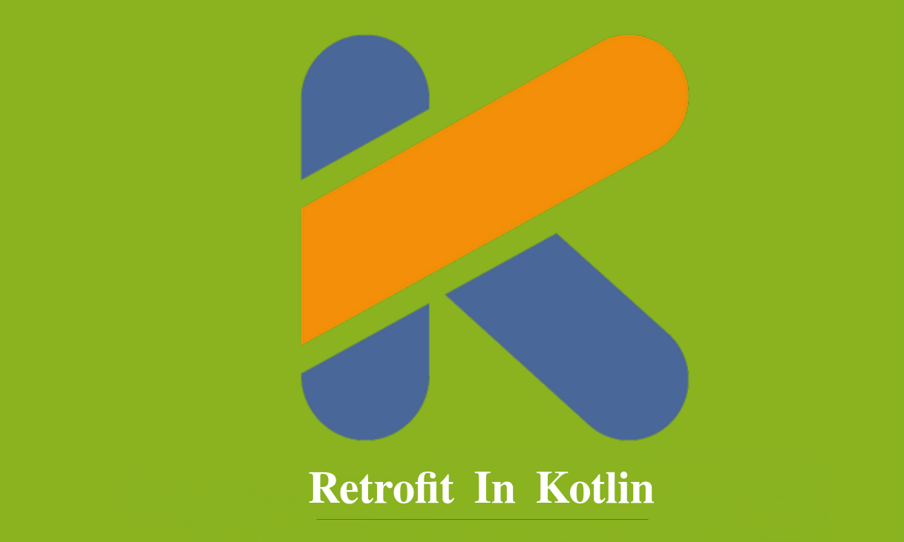

# Retrofit App use with YouTube Api 🎬 🎥



## The goal of the project 🧑🏻‍💻
It is a project targeting the use of Retrofit library and how to include and use YouTube Api in the project.


## Content of the Project ℹ️
It is an application that uses the Retrofit library and YouTube Api developed with Kotlin language. <br>


# What is Retrofit? 🤨

Retrofit is a network library. Its main purpose is to seamlessly receive JSON data over the network.
Along with receiving JSON data, it can handle all exchanges between an application and a server.
Retrofit does what the Volley library does, but it's faster than Volley. like in the volley library
No JSON parser is needed to parse JSON data. All the features required for web services
It is a very powerful library.

You can read the article below about the Retrofit - Volley comparison:

[Is Retrofit faster than Volley?](https://medium.com/@ali.muzaffar/is-retrofit-faster-than-volley-the-answer-may-surprise-you-4379bc589d7c)


# What is API ⁉️
 <br>
API (Application Programming Interface) is the interface provided by the application that shares its capabilities so that the capabilities of one application can be used in another application. In this project, we have the features that YouTube API provides to developers.
We will develop an application using


# We Make API Settings ⚙️

First of all, we will make the necessary arrangements of the Api that we will use in our application from the link below.

https://console.developers.google.com/apis/

After entering the link, press the Activate API's and Events button to select the type of API to be used in the application.
We are directed to the page we will choose. By selecting the application to be used, we click on the option to try the application below.

 <br>

We are directed to a page to try the application.

 <br>

In the example we will use in our application, we will get the id value of any channel and reach its playlists. We use the snippet option. It allows us to access all the information on the channel. We have specified the maximum data we will pull from the channel.

You can see how we can enter the video lists of any channel and get the id value in the picture below:

 <br>

After performing the above operations, we start the process by pressing the **Excute** button below.

```java 
 GET https://www.googleapis.com/youtube/v3/playlists?part=snippet&channelId=UC9IGkktBTEgUKzdWL_x2uUA&maxResults=15&key={YOUR_API_KEY}
```
 <br>
 
He gave us a url to use in the application. We will use the API KEY value belonging to the application in our project.

<p>
   
</p>

<br>

In the picture above, an API KEY value of the application is given. You will use that value. The app has no restrictions
We mark as. If you want to throw your application to the Play Store, you should only select the Android Applications option.

## Donation 💸

If this project help 💁 you to develop, you can give me a cup of coffee. ☕

[](https://www.buymeacoffee.com/halilozel1903)

## License  ℹ️
```
MIT License

Copyright (c) 2023 Halil OZEL

Permission is hereby granted, free of charge, to any person obtaining a copy
of this software and associated documentation files (the "Software"), to deal
in the Software without restriction, including without limitation the rights
to use, copy, modify, merge, publish, distribute, sublicense, and/or sell
copies of the Software, and to permit persons to whom the Software is
furnished to do so, subject to the following conditions:

The above copyright notice and this permission notice shall be included in all
copies or substantial portions of the Software.

THE SOFTWARE IS PROVIDED "AS IS", WITHOUT WARRANTY OF ANY KIND, EXPRESS OR
IMPLIED, INCLUDING BUT NOT LIMITED TO THE WARRANTIES OF MERCHANTABILITY,
FITNESS FOR A PARTICULAR PURPOSE AND NONINFRINGEMENT. IN NO EVENT SHALL THE
AUTHORS OR COPYRIGHT HOLDERS BE LIABLE FOR ANY CLAIM, DAMAGES OR OTHER
LIABILITY, WHETHER IN AN ACTION OF CONTRACT, TORT OR OTHERWISE, ARISING FROM,
OUT OF OR IN CONNECTION WITH THE SOFTWARE OR THE USE OR OTHER DEALINGS IN THE
SOFTWARE.
```


