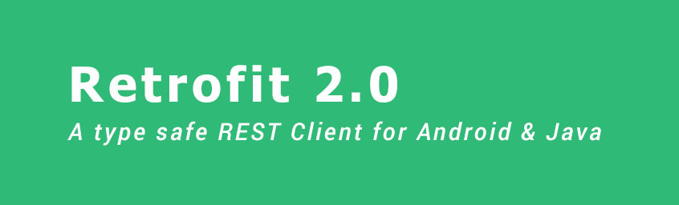

# Retrofit App


## Projenin Amacı
Retrofit kütüphanesinin kullanımını ve YouTube Api'nin projeye nasıl dahil edilip kullanılacağını hedefleyen bir projedir.


## Projenin İçeriği
Kotlin dili ile geliştirilen Retrofit kütüphanesi ve YouTube Api kullanılan bir uygulamadır. <br>

 <br>

# Retrofit Nedir ?

Retrofit bir ağ kütüphanesidir. Temel amacı ağ üzerinden JSON verilerini sorunsuz bir şekilde alınmasını sağlamaktadır.
JSON verilerini almakla birlikte, bir uygulama ile sunucu arasındaki tüm alışveriş işlemlerini yapabilir. 
Retrofit, Volley kütüphanesinin yaptığı işlemleri yapar fakat Volley'den hız olarak daha öndedir. Volley kütüphanesindeki gibi
JSON verilerini ayrıştırmak için herhangi bir JSON ayrıştırıcıya ihtiyaç yoktur. Web servisleri için gereken tüm özelliklere
sahip olan çok güçlü bir kütüphanedir. 

Retrofit - Volley karşılaştırması ile ilgili aşağıdaki yazıyı okuyabilirsiniz : 

[Is Retrofit faster than Volley?](https://medium.com/@ali.muzaffar/is-retrofit-faster-than-volley-the-answer-may-surprise-you-4379bc589d7c)

<br>

# API Nedir ?
 <br>
API (Application Programming Interface), bir uygulamaya ait yeteneklerin, başka bir uygulamada da kullanılabilmesi için, yeteneklerini paylaşan uygulamanın sağladığı arayüzdür. Bizde bu projede YouTube API'nin geliştiricilere sağladığı özellikleri
kullanarak bir uygulama geliştireceğiz.

<br>

# API Ayarlarını Yapıyoruz 

Öncelikle aşağıdaki linkten uygulamamızda kullanacağımız Api'nin gerekli düzenlemelerini yapacağız.

https://console.developers.google.com/apis/

Linke girdikten sonra Api'leri ve Etkinlikleri Aktifleştir butonuna basarak uygulamada kullanılacak olan API'nin türünü
seçeceğimiz sayfaya yönlendiriliyoruz. Kullanıcak uygulamayı seçerek aşağıdaki uygulamayı dene seçeneğine tıklıyoruz.

 <br>

Uygulamayı denemek için bir sayfaya yönlendiriliyoruz.

 <br>

Uygulamamızda kullanacağımız örnekte herhangibir kanalın id değerini alarak onun oynatma listelerine ulaşacağız. Snippet seçeneğini kullanıyoruz. Kanala tüm bilgilere ulaşmamızı sağlamaktadır. Kanaldan çekeceğimiz maksimum veriyi belirttik.

Herhangi bir kanalın video listelerine girip id değerini nasıl alırız onu aşağıdaki resimde görebilirsiniz :

 <br>

Yukarıdaki işlemleri yaptıktan sonra aşağıda bulunan **Excute** butonuna basarak işlemi başlatıyoruz.

```java 
 GET https://www.googleapis.com/youtube/v3/playlists?part=snippet&channelId=UC9IGkktBTEgUKzdWL_x2uUA&maxResults=15&key={YOUR_API_KEY}
```
 <br>
 
Uygulamada kullanabilmek adına bizlere bir url verdi. Uygulamaya ait olan API KEY değerini projemizde kullanacağız.

<p>
  
</p>

<br>

Yukarıdaki resimde uygulamaya ait bir API KEY değeri verildi. O değeri kullanacağınız. Uygulamanın kısıtlamaları yok 
şeklinde işaretliyoruz. Uygulamanızı Play Store'a atmak isterseniz sadece Android Uygulamalar seçeneğini seçmelisiniz.


